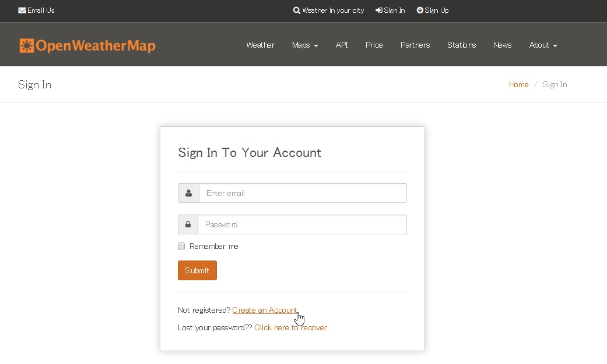
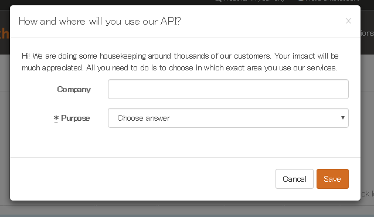
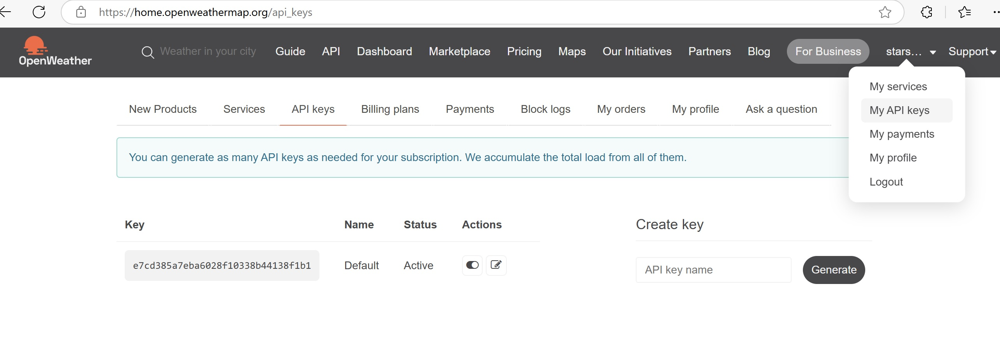

1. [ウェブページ](https://home.openweathermap.org/users/sign_in) をクリックしてアクセスする
　 

2. 画面の[Create an Account]をクリックして、アカウントを作成する
   

3. 「メール」と「パスワード」を入力して、I agree to the Terms of Service and Privacy Policy にチェックを入れ Create Account をクリック

4. 目的を確認する画面に、[Company]欄に大学名を入れて、[Purpose]欄に、「Weather widget for web]を選択してクリック
   

5. ログインにしたら、アカウント名->[My API Keys]をクリックして、下記のapi Key画面が表示される
   

6. この画面の"Key"の下の文字列をコピーして、下記のURLのappidを書き換えて、
　　https://api.openweathermap.org/data/2.5/weather?q=tama,jp&units=metric&appid= 438531953753d6e4bb36354a22ba948a

7. appidを書き換えたURLをブラウザからアクセスすれば、下記の多摩市の天気情報がjsonフォーマットで表示される。

   ```
   {
    "coord": {
        "lon": 139.4435,
        "lat": 35.6372
    },
    "weather": [
        {
            "id": 803,
            "main": "Clouds",
            "description": "broken clouds",
            "icon": "04n"
        }
    ],
    "base": "stations",
    "main": {
        "temp": 5.96,
        "feels_like": 3.98,
        "temp_min": 5.22,
        "temp_max": 6.09,
        "pressure": 1013,
        "humidity": 59,
        "sea_level": 1013,
        "grnd_level": 999
    },
    "visibility": 10000,
    "wind": {
        "speed": 2.57,
        "deg": 360
    },
    "clouds": {
        "all": 75
    },
    "dt": 1733577340,
    "sys": {
        "type": 2,
        "id": 2078606,
        "country": "JP",
        "sunrise": 1733521122,
        "sunset": 1733556538
    },
    "timezone": 32400,
    "id": 1850144,
    "name": "Tama",
    "cod": 200
   }
   ```
