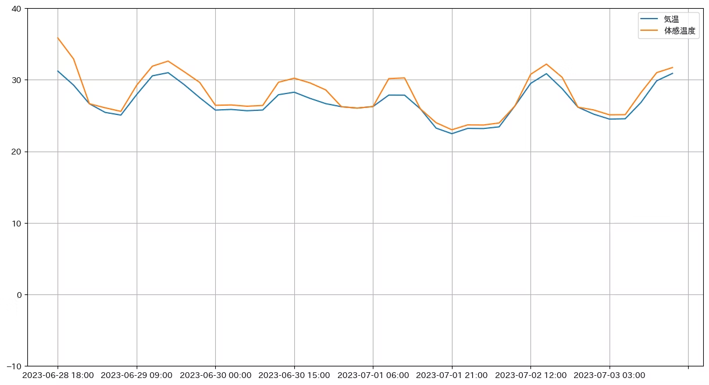

# 復習：　javascript基本知識
- javascript_demosの下の練習を改修して、結果を確認してください。
- 改修したコードをgithubのclassroomで共有する。（締め切りか次の授業の前）

# 課題１： 郵便番号に指定する場所の天気情報を取得する
- url = "https://api.openweathermap.org/data/2.5/weather?zip={郵便番号}&units=metric&appid={API_key}"

- {郵便番号}
  - 例えば："zip=110-0006,JP", 

- API_key:
  - あなたのAPI KEY

# 課題2： 経度・緯度に指定する場所の天気情報を取得する
- url = "https://api.openweathermap.org/data/2.5/weather?lat={緯度}&lon={経度}&units=metric&appid={API_key}"

- {経度}(lat)・{緯度}（lon）の値：
  - Google Mapから右クリックすることで得られます
  - 例えば："lat=35.2932718&lon=139.97671"

- API_key:
  - あなたのAPI KEY

# 次回の予告
次回は下記のようなグラフを作成して、Web APIを使って温度の変化を表示する

